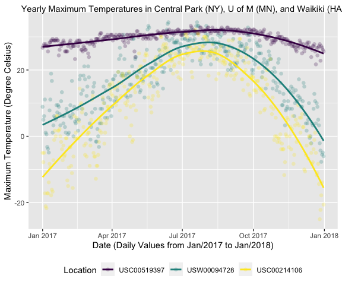

PUBH 7462 Week 2 Activity
================
Maykon Junior da Silva
1/28/22

true

# Instructions

1.  Set up a new Github repo called `pubh_7462_week_2`
2.  Clone it to your local machine in Rstudio w/ .Rproj
3.  Edit the .gitignore (add /data line)
4.  Download [Week 2 Activity
    RMD](https://canvas.umn.edu/courses/293049/assignments/2401738?module_item_id=7611944),
    save it in your directory, and edit the document to include the
    following:
      - Change output to knit to [Github
        Document](https://rmarkdown.rstudio.com/github_document_format.html)
        (`output: github_document`)
      - Add a table of contents (`toc: true`)
      - Change the toc depth (`toc_depth: 1`)
      - Download `noaa_weather.RDS` file [here](), add a `/data` folder
        to your local directory, put this file there  
      - Add to the `ggplot` below as prompted in the .RMD (below)
      - Knit the document to `github_document` .md  
5.  Use the Github workflow to push the .md and associated files to
    Github
6.  Go back to Github, view your repository, and check out the .md

# National Oceanic and Atmospheric Association (NAOO) `ggplot` Example

Here is a good example of data wrangling in the tidyverse, *however* the
`ggplot` visualization is missing a couple key elements (). Please fix
the missing aesthetics that would make it a good, stand-alone data
visualization.

## NAOO Data Wrangling

This code chunk loads and tidies an example NAOO dataset, which extracts
the 2017 daily record(s) of temperature min, max, and precipitation at
each of three weather stations (NY, Hawaii, U of M). Notice that the
chunk has the `eval = FALSE` option, this is because accessing the NOAA
API takes a bit of time. **Please don’t run this code in class**.

Instead, I’ve written out an .RDS file of the data we need and put it on
Canvas
[here](https://canvas.umn.edu/courses/293049/assignments/2401738?module_item_id=7611944).
Please create a `/data` folder in the `pubh_7462_week_2` directory on
your local machine and put the .RDS file there. We will load that data
in the next chunk with a *relative path*.

``` r
#Load RNOAA interface (and install if it's not already)
if (!require("rnoaa")) {
  install.packages("rnoaa")
}

#Create a weather data frame  
weather.df <- rnoaa::meteo_pull_monitors(
    c("USW00094728", "USC00519397", "USC00214106"), #Location IDs
    var = c("PRCP", "TMIN", "TMAX"), #Variables 
    date_min = "2017-01-01", #Dates
    date_max = "2017-12-31") %>%
  mutate(
    name = recode(id, 
           USW00094728 = "Central Park, NY", #Recode IDs variable 
           USC00519397 = "Waikiki, HA",
           USC00214106 = "U of M, MN"
           ),
    tmin = tmin / 10, #Scale temperature for viz I think it's in Kelvin? 
    tmax = tmax / 10) %>%
  select(name, id, everything())

#Write out as .RDS (generic R data file, i.e. a data frame, list, etc.)
write_rds(weather.df, "./data/roaa_weather.RDS")
```

## Example `ggplot` of Max Temperature

``` r
#Read in noaa_weather.RDS
weather.df <- read_rds("./data/roaa_weather.RDS")

#Create ggplot
max_temp.gg <- weather.df %>% 
  ggplot(aes(x = date, y = tmax, colour = name)) + 
  geom_point(alpha = 0.24, #Transparency
             size  = 2,
             shape = 16) +
  geom_smooth(formula = y ~ x, 
              method  = "loess", #Smooth mean trend
              se      = FALSE) #No Confidence interval, crowds plot

#Display max_temp.gg
max_temp.gg
```


## Your Turn

### 1\. Add missing aesthetics to the above Max Temp plot

Create a new code chunk and please add these aesthetics to the ggplot
above:

  - meaningful title  
  - meaningful axis labels  
  - colour pallete + meaningful legend title
      - `+ scale_colour_viridis_d("Title")`

<!-- end list -->

``` r
# Create an updated ggplot with aesthetics described above
max_temp.gg <- weather.df %>%
  ggplot(aes(x = date, y = tmax, colour = name)) +
  geom_point(alpha = 0.24,
             size = 2,
             shape = 16) +
  geom_smooth(formula = y ~ x,
              method  = "loess",
              se      = FALSE) +
  labs(title = "Yearly Maximum Temperatures in Central Park (NY), U of M (MN), and Waikiki (HA)") +
  ylab("Maximum Temperature (Degree Celsius)") +
  xlab("Date (Daily Values from Jan/2017 to Jan/2018)") +
  scale_colour_viridis_d("Location")

# Display the updated ggplot
max_temp.gg
```

    ## Warning: Removed 9 rows containing non-finite values (stat_smooth).

    ## Warning: Removed 9 rows containing missing values (geom_point).


- **Bonus**  
\- use `forcats::fct_reorder()` to reorder the id name by the maximum
Max Temp in descending order (from highest to lowest) - will have to
transform to factor first w/ `as.factor()`

You may do so by simply writing `max_temp.gg + ...`

``` r
# Transforming ID to factor
weather.df$id <- as.factor(weather.df$id)

# Bonus activity
max_temp.gg <- weather.df %>%
  ggplot(aes(x = date, y = tmax, colour = fct_reorder2(id, date, tmax, .desc = TRUE))) +
  geom_point(alpha = 0.24,
             size = 2,
             shape = 16) +
  geom_smooth(formula = y ~ x,
              method  = "loess",
              se      = FALSE) +
  labs(title = "Yearly Maximum Temperatures in Central Park (NY), U of M (MN), and Waikiki (HA)") +
  ylab("Maximum Temperature (Degree Celsius)") +
  xlab("Date (Daily Values from Jan/2017 to Jan/2018)") +
  scale_colour_viridis_d("Location")

# Display the reorderd ggplot
max_temp.gg
```

    ## Warning: Removed 9 rows containing non-finite values (stat_smooth).

    ## Warning: Removed 9 rows containing missing values (geom_point).


\#\#\# 2. (If time allows) Create a `ggplot` of precipitation by
location

``` r
# Creating a ggplot of precipitation by location
precipitation.gg <- weather.df %>%
  ggplot(aes(x = date, y = prcp, colour = name)) +
  geom_point(alpha = 0.24,
             size = 2,
             shape = 16) +
  geom_smooth(formula = y ~ x,
              method  = "loess",
              se      = FALSE) +
  labs(title = "Yearly Precipitatation in Central Park (NY), U of M (MN), and Waikiki (HA)") +
  ylab("Precipitation (mm)") +
  xlab("Date (Daily Values from Jan/2017 to Jan/2018)") +
  scale_colour_viridis_d("Location")

# Display precipitation by location ggplot
precipitation.gg
```

    ## Warning: Removed 12 rows containing non-finite values (stat_smooth).

    ## Warning: Removed 12 rows containing missing values (geom_point).


### 3\. Push to Github

If you’ve completed the first or both tasks, then please knit the
document as a `github_document`. Next, please add, commit, and push your
changes to the Github repository connected to this project. Note that
you will need to push all the associated files (contains the .html for
the figures you’ve created) as well as the .md and .rmd. In addition,
you may need to create a personal access token ([with these
instructions](https://docs.github.com/en/authentication/keeping-your-account-and-data-secure/creating-a-personal-access-token))
and use that as a password when prompted to login to github. Finally, go
back to your github and check out your fine work by clicking on the
newly knitted .md file in your repository\!
